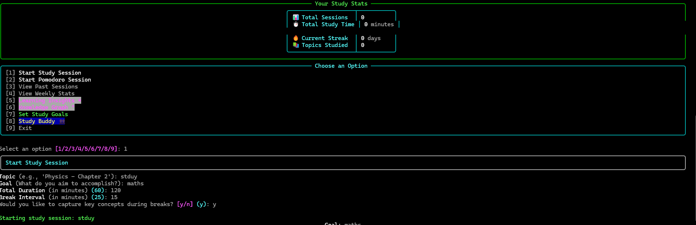
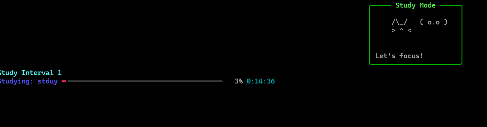
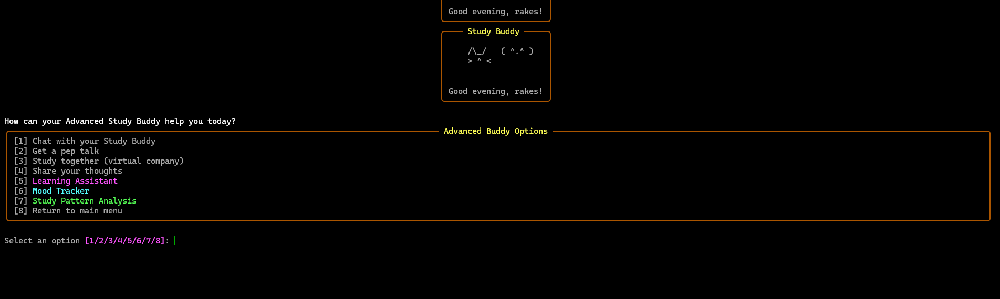
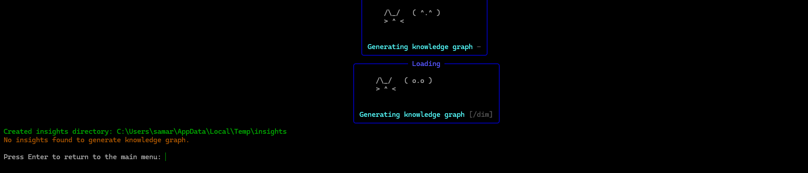
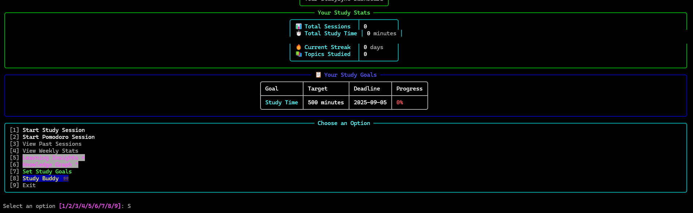
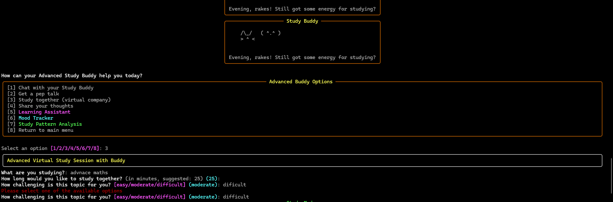
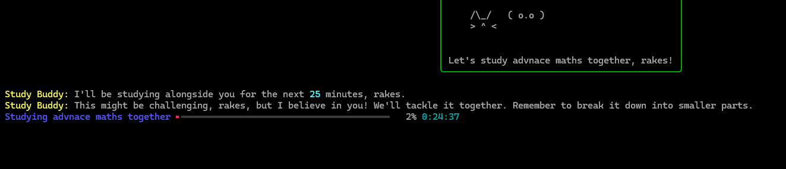

# StudySync CLI

StudySync CLI is a terminal-based productivity and accountability tool for solo learners. It helps users plan focused study sessions, track their focus levels, and reflect on their learning progress over time.

## Features

- **Start Study Sessions**: Set up study sessions with customizable durations and break intervals
- **Focus Tracking**: Record your focus level after each break
- **Session Summaries**: View detailed summaries of completed sessions
- **Progress Analysis**: Track your weekly study patterns and focus trends
- **Export Options**: Save session data as JSON, text, or markdown
- **Learning Insights**: Capture key concepts during breaks and review them using spaced repetition principles
- **Knowledge Graph**: Visualize relationships between study topics
- **Cat Animations**: Enjoy cute cat animations that make studying more fun

## Installation

### Prerequisites

- Python 3.6 or higher
- pip (Python package installer)

### Setup for Windows

1. Clone or download this repository
2. Open Command Prompt or PowerShell
3. Navigate to the project directory
4. Create a virtual environment:
   ```
   python -m venv venv
   ```
5. Activate the virtual environment:
   ```
   .\venv\Scripts\activate
   ```
6. Install the required packages:
   ```
   pip install -r requirements.txt
   ```

### Setup for Linux/macOS

1. Clone or download this repository
2. Open Terminal
3. Navigate to the project directory
4. Create a virtual environment:
   ```
   python3 -m venv venv
   ```
5. Activate the virtual environment:
   ```
   source venv/bin/activate
   ```
6. Install the required packages:
   ```
   pip install -r requirements.txt
   ```

## Usage

1. Activate your virtual environment (if not already activated)
2. Run the application:
   ```
   python studysync/main.py
   ```
3. Use the menu to navigate through the application

## Example Session Flow

1. **Start a Study Session**:
   - Select option 1 from the main menu
   - Enter your study topic (e.g., "Python - Data Structures")
   - Enter your goal (e.g., "Complete exercises 1-5")
   - Set the total duration (e.g., 60 minutes)
   - Set the break interval (e.g., 25 minutes)
   - The session will start with a timer and a cute studying cat animation
   - After each break interval, you'll be prompted to rate your focus (1-5)
   - During breaks, you can capture key concepts you've learned
   - The session ends when the total time is complete with a celebration cat animation

2. **View Session Summary**:
   - After a session ends, you'll see a summary with:
     - Total study time
     - Focus scores for each break
     - Average focus score
   - The session data is automatically saved as a JSON file

3. **View Past Sessions**:
   - Select option 2 from the main menu
   - Choose a session from the list to view its details

4. **View Weekly Stats**:
   - Select option 3 from the main menu
   - See your study patterns and focus trends for the past week

5. **Learning Insights**:
   - Select option 4 from the main menu
   - View your study topics with their learning effectiveness scores
   - Review concepts that are due for review based on spaced repetition
   - Add relationships between topics to build your knowledge graph

6. **Knowledge Graph**:
   - Select option 5 from the main menu
   - Visualize the connections between your study topics

## You can use it directly on windows with build 
   - Navigate to build directory and download studysync.exe
  
## Screenshots













